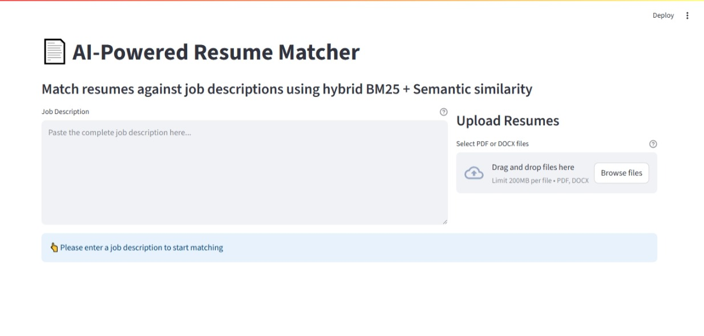
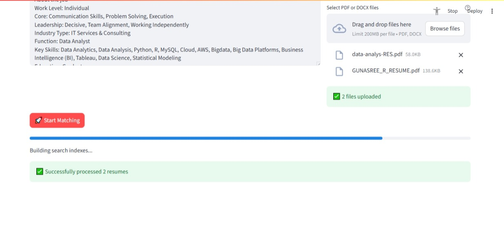
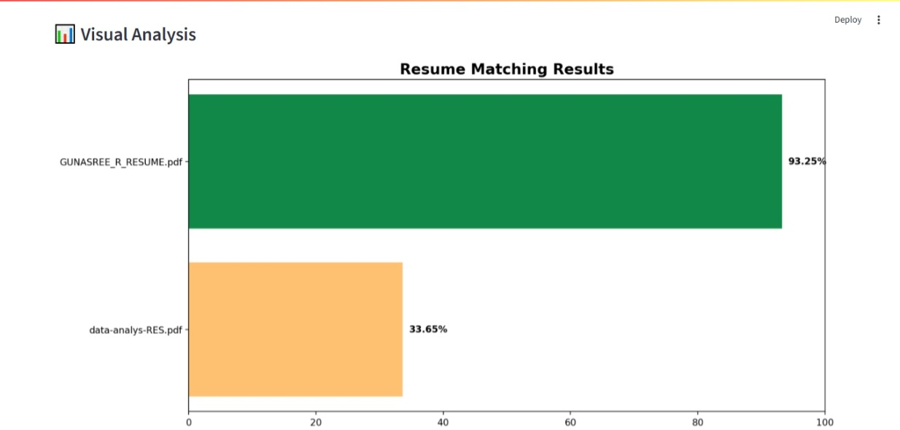
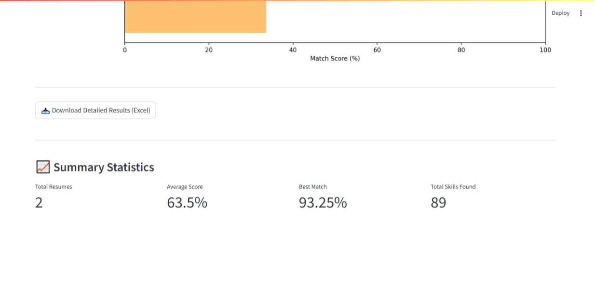

# 📄 AI-Powered Resume Matcher

🚀 A powerful NLP tool that matches resumes against a job description using a hybrid BM25 + semantic similarity engine.


## ✨ Features

✅ Upload a **job description (JD)**.  
✅ Upload **multiple resumes (PDF or DOCX)**.  
✅ Automatically ranks resumes with a **% match score**.  
✅ Visual analytics with a color-coded bar chart.  
✅ Download detailed results as an Excel sheet.  
✅ See extracted **skills, experience**, and other metadata.  
✅ Supports hybrid scoring with **BM25 + FAISS semantic search** for best accuracy.
  
## ⚙️ Tech Stack

- **Python** 🐍 (Streamlit for UI)
- **BM25 (Rank-BM25)** for lexical similarity
- **FAISS + Sentence Transformers** for semantic similarity
- **Spacy, NLTK** for NLP processing
- **Matplotlib & Pandas** for plots & data
- **PyPDF2, python-docx** for text extraction
- 
## 🖼️ Application Screenshots

### 1. Home Screen


### 2. Upload Job Description & Resumes


### 3. Matching the JD and Resumes 


### 4. Visual Analytics Dashboard


### 5. Excel Export & Summary


## 🚀 Quick Start

```bash
# Clone repository
git clone https://github.com/yourusername/resume-matcher.git 
cd resume-matcher

# Install dependencies
pip install -r requirements.txt
python -m spacy download en_core_web_sm

# Run application
streamlit run app.py
```

## 📁 Project Structure
```
resume-matcher/
├── app.py                 # Main application code
├── requirements.txt       # Dependencies
├── screenshot/            # Application screenshots
│   ├── home.jpeg
│   ├── upload_jd_and_resume.jpeg
│   ├── visual_analytics.jpeg
│   └── excel_and_summary.jpeg
└── resume_analysis_results.xlsx  # Sample output
```

## 📝 Notes
- All screenshots are stored in the `/screenshot` directory
- Sample Excel output included for reference
- Replace placeholder GitHub URL with your actual repository
<<<<<<< HEAD

## 🔧 Troubleshooting
1. Ensure screenshots are stored exactly as: screenshot/FILENAME.jpeg
2. If images don't load on GitHub:
   Verify filenames match (case-sensitive).
   Ensure extensions are .jpeg (not .jpg).
3. If faiss or torch gives CUDA errors:
   Use CPU device (already configured with device='cpu' in your code).
   
## 📚 Documentation
- [System Architecture](docs/ARCHITECTURE.md)


[](https://github.com/rgunasree/resume-matcher)
```
